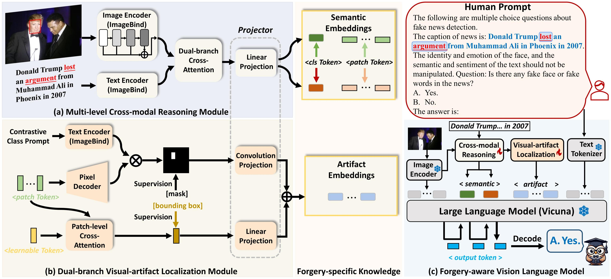

# FKA-Owl: Advancing Multimodal Fake News Detection through Knowledge-Augmented LVLMs

### 1. Introduction: 

**FKA-Owl** pioneers leveraging rich world knowledge from large vision-language models (LVLMs) and enhancing them with forgery-specific knowledge, to tackle the domain shift issue in multimodal fake news detection. We propose two lightweight modules for forgery-specific knowledge augmentation: the cross-modal reasoning module and the visual-artifact localization module to extract semantic correlations and artifact traces, respectively.

The proposed FKA-Owl is built upon the off-the-shelf LVLM consisting of an image encoder and a Large Language Model (LLM). Given a manipulated image-text pair, the cross-modal reasoning module (a) first extracts cross-modal semantic embeddings and visual patch features. Then, these visual patch features are processed by the visual-artifact localization module (b) to encode precise artifact embeddings. Finally, the semantic and artifact embeddings are incorporated into the forgery-aware vision-language model (c) combined with image features and the human prompt for deep manipulation reasoning.

